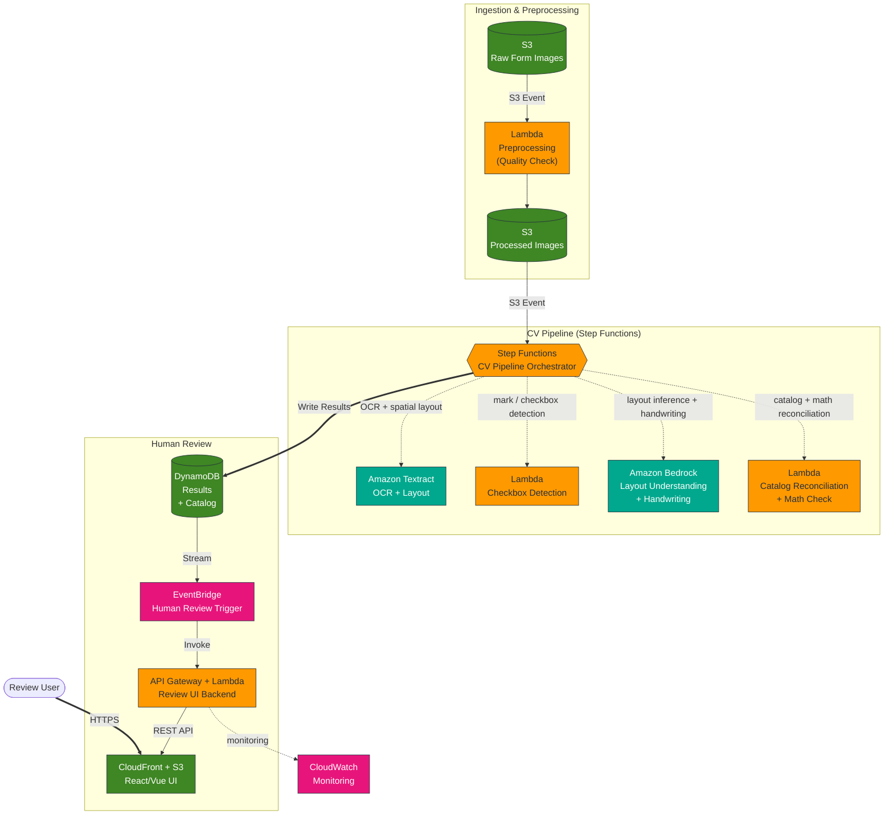

# Reference Architecture — Mobile Document Capture on Serverless

A serverless computer-vision pipeline that turns captured images of printed/handwritten
forms into structured, validated data, with a human-in-the-loop review step. This is a
reference shape — the design phase decides the concrete services and topology for your project.

## Legend

- **Solid arrows** — Data flow
- **Dotted arrows** — CV workstream fan-out (Step Functions)
- **Thin dotted line** — Monitoring (CloudWatch)

## Workstreams

A typical extraction pipeline decomposes into independent workstreams that the Step Functions
orchestrator fans out and merges:

1. **Image capture & pre-processing** — multi-page capture with on-device quality gating (blur/glare/coverage checks, edge detection, perspective correction) before upload.
2. **OCR with spatial preservation** — layout-aware OCR that returns bounding boxes per token/line.
3. **Layout understanding** — infer table/structure from the page when the template is unknown.
4. **Checkbox / mark detection** — detect which items/rows are selected.
5. **Handwritten quantity recognition** — read handwritten values.
6. **Catalog reconciliation** — match extracted text to a reference catalog (e.g. embedding similarity over name + variant + size).
7. **Math reconciliation** — validate arithmetic (e.g. `qty × unit_price ≈ line_total`; sum of line totals ≈ printed total, within rounding tolerance).
8. **Human-in-the-loop review** — the user edits and confirms the digitized result before it is accepted.

## Cost note

Serverless, pay-per-use pricing keeps a low-volume workload inexpensive and maintenance-free
compared with an always-on compute equivalent. Bedrock/Textract calls typically dominate cost —
validate current pricing and regional availability against the AWS Knowledge MCP for your target
region and volume before committing to a design.
